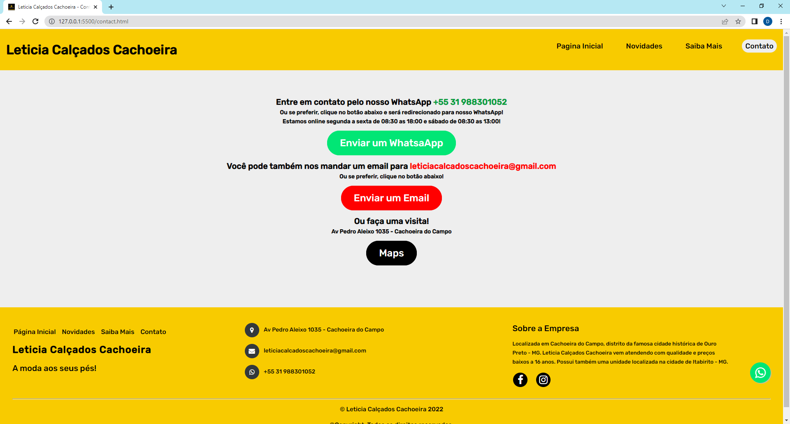

# Esboço de um WebSite simples responsivo.

> Foram usados HTML, CSS e JavaScript
<h4>Esse é um site simples responsivo, foi construído com intuito de colocar em prática o que estou estudando no momento.</h4>
<h4>A loja 'Letícia Calçados Cachoeira' existe e foi usada como referência para construção com prévia autorização do dono, podendo no futuro transformar em um projeto de WebSite real!</h4>

<h4>Para visualizar o site em seu dispositivo, basta copiar ou clilcar no link: <a href="https://leticiacalcadoscachoeira.netlify.app/">leticiacalcadoscachoeira.netlify.app</a></h4>

<h2>
Esboço do Site no Desktop</h2>

<h3 align="center">Pagina Inicial</h3>
<h1 align="center">
   
</h1>

<h3 align="center">Pagina Contato</h3>
<h1 align="center">
   
</h1>

<h3 align="center">Rodape do Site</h3>
<h1 align="center">
   
</h1>

<h2>Esboço do Site no Celular</h2>

<h3 align="center">Pagina Inicial no celular</h3>
<h1 align="center">
   
</h1>

<h3 align="center">Rodape no celular</h3>
<h1 align="center">
   
</h1>

<h3 align="center">Pagina Contato no celular</h3>
<h1 align="center">
   
</h1>

<h3 align="center">Menu de opções (Apenas no celular ou dispositivos com tela/janela do navegador reduzida)</h3>
<h1 align="center">
   
</h1>

<h3 align="center">Funcionamento do menu de opções</h3>
<h1 align="center">
   
</h1>